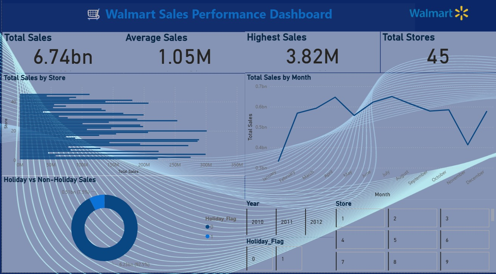

# Walmart-Sales-Analysis
SQL and Power BI dashboard for Walmart sales analysis.
# 🛒 Walmart Sales Analysis using SQL & Power BI

## 📌 Project Overview
This project analyzes Walmart sales data using SQL and Power BI to identify sales trends, store performance, and the impact of holidays on sales.

## 🛠 Tools Used
- MySQL
- Power BI
- SQL
- Excel

## 📂 Dataset
The dataset includes:
- Store
- Date
- Weekly Sales
- Holiday Flag
- Temperature
- Fuel Price
- CPI
- Unemployment

## 📊 Dashboard Features
- Total Sales KPI
- Average Weekly Sales KPI
- Highest Weekly Sales KPI
- Total Stores KPI
- Sales by Store
- Monthly Sales Trend
- Holiday vs Non-Holiday Sales
- Interactive Slicers

## 💡 Business Insights
- Identified top-performing stores.
- Compared holiday and non-holiday sales.
- Analyzed monthly sales trends.
- Built an interactive dashboard for decision-making.

## 📷 Dashboard Preview

## 📷 Dashboard Preview

## 📁 Files
- Walmart_Dashboard.pbix
- Walmart_SQL_Queries.sql
- Walmart.csv
- dashboard.png
